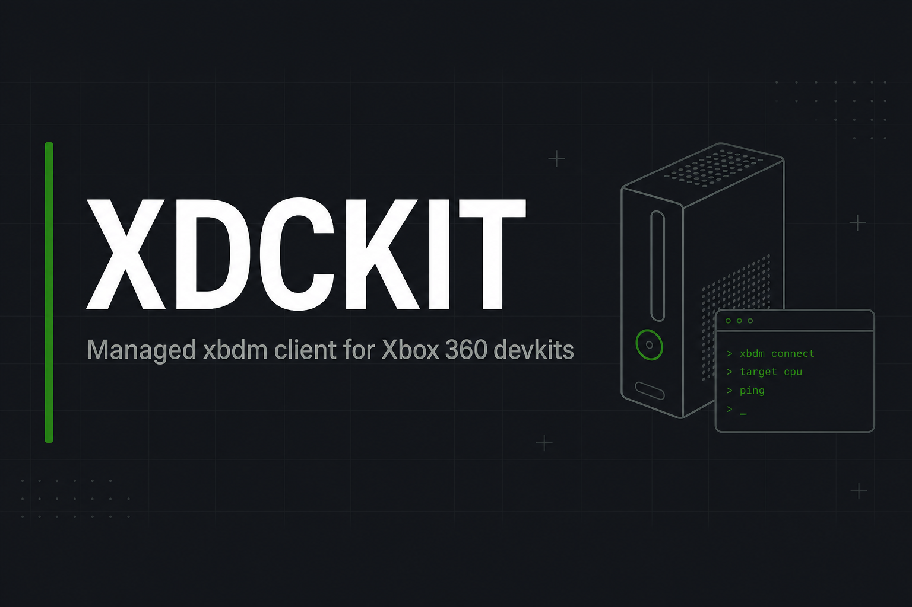

<<<<<<< Updated upstream
<p align="center">
  
</p>

#  Xbox Direct Connect Kit (XDCKIT)
Give A ⭐ To Support This Project.

[](https://github.com/XBM360/XDCKIT/releases)
[](https://discord.gg/6cEdez7cge)
[](https://dotnet.microsoft.com/)
[](https://github.com/xenia-canary/game-patches)
[](#license)

An open source library designed to **emulate / imitate the XDevkit library extension** so it works just like the original — plus a stack of new features (live xbdm discovery, screenshots, RPC, Xenia game-patches, async surface, and more).

I am known as **Serenity** (also **TeddyHammer**). If you want to reach me, join the server.
Have ideas or suggestions? Join us on the [Discord Server](https://discord.gg/6cEdez7cge)!

| Quick link | What's there |
|:-----------|:-------------|
| 📋 [`docs/STATUS.md`](./docs/STATUS.md) | ASCII status banner, timeline, credits, change log |
| 📘 [`docs/USE_CASES.md`](./docs/USE_CASES.md) | Copy-paste recipes (connect / memory / files / screenshot / patches) + mermaid diagram |
| 🧩 [xenia-canary/game-patches](https://github.com/xenia-canary/game-patches) | Upstream `.patch.toml` format that `console.Patches` can load |

---

# Features

> Legend: `✅` shipped · `🧪` beta / experimental · `🚧` in development

### General Features
```markdown
1.  ✅ Get SMC Version
2.  ✅ Reboot console or game title (Cold / Warm, magicboot with title/dir/cmdline)
3.  ✅ XboxShortcuts            (Guide Button + Friends List, Achievements, Avatar Editor, ...)
4.  ✅ Get Box ID               (Xbox identification number, BOXID)
5.  ✅ Set Console Color        (black, blue, bluegray, nosidecar, white — Neighborhood tag)
6.  ✅ Get Console ID           (getconsoleid)
7.  ✅ Get DM Version           (dmversion)
8.  ✅ Get System Info          (HDD / Type / Platform / System / Krnl / XDK)
9.  ✅ Reboot Cold or Warm      (magicboot cold | warm)
10. ✅ Freeze Console           (Stop / Go)
11. ✅ Get Console Type         (Devkit / Testkit / Reviewerkit)
12. ✅ CloseConnection / Disconnect
13. ✅ Reconnect (configurable reconnect delay)
14. ✅ OpenConnection           (also auto-discovery on the LAN — see Connect())
15. ✅ Get CPU Key
16. ✅ Get Kernel Version       (via consolefeatures RPC type=13)
17. ✅ Get Temperature          (CPU / GPU / EDRAM / MotherBoard)
18. ✅ Set LED State            (per-quadrant: OFF / RED / GREEN / ORANGE)
19. ✅ Module handle / module sections / walk loaded modules
20. 🧪 Launch System DLL thread (via RPC)
21. 🧪 Unload Image
22. ✅ XEX field reader         (xexfield → title id, header fields)
23. ✅ GetTitleID
24. ✅ ShutDown
25. 🧪 Quick Sign In
26. ✅ Fan Speed message builder
27. 🧪 Get Sign In State        (returns uint via xboxkrnl ordinal)
28. ✅ Trainer-style features   (constant memory writes for share-able mods)
29. ✅ DmScreenShot             (full status + metadata + binary read in one helper)
30. ✅ LAN discovery            (FindFirstConsoleOnLan / FindAllConsolesOnLan / xbdm UDP name service)
31. ✅ Secure / shared connection (OpenSecureConnection, MakeSharedConnection)
```

### Debugging Features
```markdown
1.  ✅ NULL_Address          (zero a region — uses SetMemory)
2.  ✅ SetBreakpoint
3.  ✅ ClearBreakpoint        (formerly RemoveBreakpoint)
4.  ✅ ClearAllBreakpoints
5.  ✅ SetInitialBreakpoint
6.  ✅ SetDataBreakpoint      (OnRead / OnWrite / OnReadWrite / OnExecute)
7.  ✅ IsBreak                (is address breakpointed?)
8.  ✅ InvalidateMemoryCache
9.  ✅ Poke                   (Write* family — typed writes)
10. ✅ Peek                   (Read* family — typed reads, PowerPC BE aware)
11. ✅ Find Hex Offset        (memory scan via GetMemory)
12. ✅ Constant Memory Setting (consolefeatures type=18, with titleId / ifValue overloads)
13. ✅ Constant Memory Set
14. ✅ GetMemory / SetMemory
15. ✅ Dump Memory            (file streaming, configurable chunk size)
16. ✅ ResolveFunction        (module + ordinal → runtime address)
17. ✅ ReverseBytes           (block byte swap; PPC BE marshalling)
18. ✅ Bool {Get; Set;}
19. ✅ String {Get; Set;}     (ASCII + Wide UTF-16)
20. ✅ Float / Double {Get; Set;}
21. ✅ BinaryData {Get; Set;} (GetMemory / SetMemory)
22. ✅ Byte / SByte {Get; Set;}
23. ✅ Int16 / Int32 / Int64 {Get; Set;}
24. ✅ UInt16 / UInt32 / UInt64 {Get; Set;}
25. ✅ XOR / AND / OR helpers for every int width
26. ✅ WriteVector1 / 2 / 3
27. ✅ WriteHook               (PowerPC 4-instruction absolute branch, optional bctrl)
28. ✅ SendTextCommand         (raw xbdm — for anything not yet wrapped)
29. ✅ AttachDebugger / DetachDebugger / IsDebuggerPresent
30. ✅ Thread context get/set  (control / int / fp / vector registers)
31. ✅ StopOn / NoStopOn       (fce / debugstr / createthread / stacktrace / modload)
```

### Current FileSystem Features
```markdown
1.   ✅ ChangeTime
2.   ✅ CreationTime
3.   ✅ bool IsDirectory
4.   ✅ bool IsReadOnly        (via GetFileAttributes)
5.   ✅ GetFile size           (via DirList / GetFileAttributes)
6.   ✅ MakeDirectory
7.   ✅ RemoveDirectory        (Delete with isDirectory:true)
8.   ✅ DirectoryFiles         (DirList → XboxDirEntry[])
9.   ✅ Get FileName           (helper on entries)
10.  ✅ ReceiveBinaryData      (Client.ReadExact / ReceiveSocketLine / ReceiveStatusResponse)
11.  ✅ ReceiveFile / GetFile  (203-binary path, big-endian uint length)
12.  ✅ SendBinaryData         (SendBinary + atomic SendBinaryAndReceiveStatus)
13.  ✅ SendFile               (parses full trailing status — failures surface)
14.  ✅ RenameFile
15.  ✅ ReadFilePartial / WriteFilePartial
16.  ✅ DmSendVolumeFile       (batch upload to a write-locked volume)
17.  ✅ WalkDir                (recursive enumeration)
```

### XNotify Features
```markdown
🔔 Pops a console notification (consolefeatures type=12 fast path, then XAM ordinal 0x282 fallback).
   Returns bool so callers know whether either path succeeded.

1.  ✅ console.Notify(message)
2.  ✅ console.Notify(message, XNotiyLogo)
3.  ✅ XMessageBoxUI           (multi-box stacking via Xam — Helpers/XMessageBoxUI.cs)
```

> **API note:** in this revision `Notify` is a **method on `XboxConsole`** — call it directly as
> `console.Notify("hi")`. The legacy `console.Notify.Show(...)` helper has been folded in.

### Xenia Game-Patches  🆕
```markdown
✅ Load `.patch.toml` from the Xenia Canary game-patches repo
✅ Parse [[patch]] + [[patch.be8/be16/be32/be64/array/f32/f64/string/u16string]]
✅ Apply only `is_enabled = true` rows (respects upstream convention)
✅ Per-console facade: console.Patches.LoadFile / LoadDirectory / ApplyEnabled
```

# So Many More Features!

# Requirements

**1.** A working network connection between PC and console.
**2.** Working knowledge of **C#** (.NET Framework 4.8 / LangVersion 9).
**3.** Familiarity with how Xbox **XDevkit / xbdm** works.
**4.** A modded / dev Xbox console with **xbdm** reachable on TCP/730.

---

## Code example

```csharp
using System;

namespace MyXboxApp
{
    public partial class Form1 : Form
    {
        // Per-console instance.  Multiple consoles in one process are now safe
        // (timeouts are per-instance, not static).
        public static XboxConsole ConsoleX = new XboxConsole();

        public Form1() => InitializeComponent();

        private void ConnectButton_Click(object sender, EventArgs e)
        {
            // 1. Auto-discover on the LAN (UDP name probe + TCP banner scan):
            ConsoleX.Connect();

            // 2. Connect by IP:
            //    ConsoleX.Connect("192.168.0.71");

            // 3. Connect by IP + port (xbdm is almost always 730):
            //    ConsoleX.Connect("192.168.0.71", 730);

            // 4. Or by friendly name (xbdm UDP name service):
            //    string ip = XboxClient.ResolveXboxName("MyDevKit");
            //    ConsoleX.Connect(ip);

            if (!ConsoleX.Connected) return;

            ConsoleX.Notify("XDCKIT online", XNotiyLogo.FLASHING_XBOX_LOGO);

            // Typed BE reads/writes:
            uint title = ConsoleX.GetTitleId();
            ConsoleX.WriteUInt32(0x82001234, 0xDEADBEEF);

            // Screenshot:
            var info = ConsoleX.Screenshot(out byte[] pixels);

            // Xenia patches:
            ConsoleX.Patches.LoadDirectory(@"C:\game-patches\patches");
            int writes = ConsoleX.Patches.ApplyEnabled();

            ConsoleX.Disconnect();
        }
    }
}
```

[](./docs/USE_CASES.md) For more examples (memory, files, screenshots, automation, Xenia patches, wire tracing, mermaid flow diagram).

## Quick Guide

### Getting started

Build from source (open **`XCE Tools.sln`** in Visual Studio 2019+ and reference `XDCKIT.csproj`), or grab the latest release from [Releases](https://github.com/XBM360/XDCKIT/releases).

### Connection

Both devices must be on the **same LAN** (same Wi-Fi SSID or wired into the same router/switch). Make sure **xbdm** is running on the console and reachable on **TCP/730**.

### Xbox 360 plugin requirements

`xbdm.xex` running on the console. For the **consolefeatures** RPC fast paths (XNotify, CPU key, temperature, LEDs, kernel version, constant memory), an xbdm plugin that implements `consolefeatures` must be loaded. The xbdm-native commands (memory, files, screenshot, breakpoints, etc.) work without any extra plugin.

### Computer requirements

A working tool / host application that references **`XDCKIT.dll`** (built against .NET Framework 4.8).

---
## Contributors

* [@ohhsodead](https://github.com/ohhsodead) — code enhancements and performance help
* **Serenity / TeddyHammer** — project lead
* **Vodka Doc** — credits

See [`docs/STATUS.md`](./docs/STATUS.md) for full inspiration / source credits (Yelo, PeekPoker, Ascension Tool, community consolefeatures RPC plugins).

## Disclaimer

I have no liability for any damages done to your system by using this extension. Use at your own risk.

## License

This project is released under the **GNU General Public License v3**.

---

*README last updated: May 2026*
=======
# XDCKIT (library)

Managed **xbdm** client and **XDevkit**-style helpers for Xbox 360 development kits.

**Documentation (status, use cases, banner):** see the repository [README.md](../../README.md) and the [docs/](../../docs/) folder at the solution root.

Build: reference `XDCKIT.csproj` from your app (net48, LangVersion 9).
>>>>>>> Stashed changes
