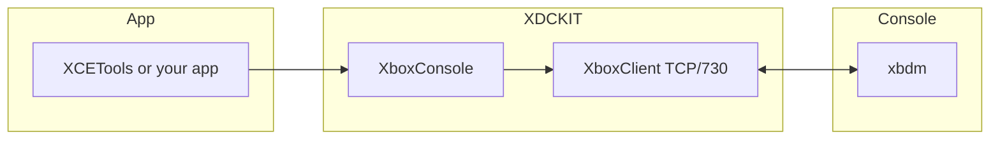

# XDCKIT — use cases & recipes

Visual legend used throughout:

| Icon | Meaning |
|:----:|---------|
| 🔌 | Connect / transport |
| 🧠 | Memory read/write |
| 📁 | Files |
| 🖼️ | Screenshot |
| 🔔 | On-screen notify (`Notify`) |
| 🎮 | Controller / automation |
| 🧩 | Xenia-style `.patch.toml` |
| 🔧 | xbdm text command |

---

## 1. Connect to a kit on the LAN 🔌

**Goal:** Find the first console answering xbdm on port 730, then talk to it.

```csharp
var console = new XboxConsole();
if (!console.Connect())
{
    Console.WriteLine("No devkit found on LAN.");
    return;
}
Console.WriteLine("Connected.");
```

**Variants**

- `console.Connect("192.168.1.71")` — known IP  
- `console.Connect("192.168.1.71", 730)` — explicit port  
- `XboxClient.ResolveXboxName("MyKit")` — UDP name probe (returns IP string)

---

## 2. Raw xbdm command 🔧

**Goal:** Send any command string and inspect status + body.

```csharp
var resp = console.SendTextCommand("getexecstate");
Console.WriteLine($"{(int)resp.Status} {resp.StatusMessage}");
```

Use this when a helper has not wrapped a command yet.

---

## 3. Typed memory (PowerPC big-endian) 🧠

**Goal:** Read/write scalars and arrays like a debugger.

```csharp
uint addr = 0x82001234;
uint title = console.ReadUInt32(addr);
console.WriteUInt32(addr, title ^ 0x10000);

float[] verts = console.GetFloat(0x40000000, 9);
console.SetFloat(0x40000000, verts);
```

**Tip:** `GetMemory` / `SetMemory` are the low-level byte paths; typed helpers handle endianness for you.

---

## 4. Screenshot to disk 🖼️

**Goal:** Pull the front buffer and save bytes (or your own DDS/TGA encoder).

```csharp
var info = console.Screenshot(out byte[] rgba);
File.WriteAllBytes(@"C:\temp\frame.raw", rgba);
// info.Width / info.Height / info.Pitch / info.Format — parse metadata for viewers
```

---

## 5. Toast notification 🔔

**Goal:** Show a dashboard notification (consolefeatures fast path, then XAM fallback).

```csharp
bool ok = console.Notify("Build finished", XNotiyLogo.FLASHING_XBOX_LOGO);
if (!ok) Console.WriteLine("Notify path failed (no plugin / wrong state).");
```

Default icon overload: `console.Notify("Hello");`

---

## 6. Directory listing & download 📁

**Goal:** List `HDD:\` and pull one file.

```csharp
foreach (var e in console.File.DirList(@"HDD:\"))
    Console.WriteLine($"{e.Name}  size={e.Size}");

console.File.GetFile(@"HDD:\some\path.bin", @"C:\local\path.bin");
```

---

## 7. Controller automation 🎮

**Goal:** Drive a virtual pad for a user slot.

```csharp
console.Automation.BindController(UserIndex.Zero, 16);
var pad = new XBOX_AUTOMATION_GAMEPAD
{
    Buttons = XboxAutomationButtonFlags.A_Button,
    LeftThumbX = 0, LeftThumbY = 0,
};
console.Automation.SetGamepadState(UserIndex.Zero, ref pad);
```

---

## 8. Load Xenia Canary game-patches 🧩

**Goal:** Reuse community `.patch.toml` files from [xenia-canary/game-patches](https://github.com/xenia-canary/game-patches) against a **running title** on hardware (same virtual addresses xbdm sees).

```csharp
// Clone or copy the repo's `patches/` folder locally, then:
console.Patches.LoadDirectory(@"D:\repos\game-patches\patches");
int writes = console.Patches.ApplyEnabled(); // only [[patch]] with is_enabled = true
Console.WriteLine($"Applied {writes} writes.");

// Or load one file:
var pf = console.Patches.LoadFile(@"D:\patches\454108D8 - Example.patch.toml");
pf.Apply(console, "60 FPS"); // by patch name
```

**Important:** Match **title** and ideally **module hash** to the build you are patching. Wrong builds need a ported patch (same rule as Xenia).

---

## 9. XDevkit-shaped interop (optional)

**Goal:** Drop-in managed types under the `XDevkit` namespace for tooling that expected COM-shaped APIs — see `XDCKIT/Interop/`.

---

## 10. Wire tracing (debug builds)

**Goal:** Log every command/response.

```csharp
console.Client.CommandSent += cmd => Debug.WriteLine(">> " + cmd);
console.Client.ResponseReceived += r => Debug.WriteLine("<< " + r);
```

---

### Flow overview (high level)



---

More detail: [STATUS.md](./STATUS.md) · Library entry: [../README.md](../README.md)
